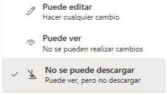

⬆️ _Haz click en "ikergl" para volver a la página de inicio._   

# Malditos adjuntos…

## …¡adjuntos malditos!

Te podrían quemar en una hoguera por enviarme ese PowerPoint, Excel o Word como adjunto en un mail. ¡Hereje!

Si fuera algo informativo, te librarías. Pero si pretendes que colaboremos sobre ese contenido... mal empezamos, porque ese adjunto está maldito. Esto es lo que pasará:
- Perderemos tiempo con idas y venidas adjuntando evoluciones del fichero en mails o chats.
- Tendremos dudas sobre cuál es la última versión. 
- Seremos más lentos porque nos esperaremos uno al otro para avanzar. O peor: cruzaremos ficheros y ninguno tendrá el último contenido. 
- Y sobre todo, ¡nos volveremos locos poniendo versiones y fechas en el nombre del fichero! 😭

 

_Dato superútil: los peces pulmonados (en inglés lungfish) tienen la mayor longitud de genoma conocido, con un total de 130 mil millones de pares de bases. Sabiéndolo, estás listo para la viñeta 😂:_

_Fuente:_ [_https://xkcd.com/3064/_](https://xkcd.com/3064/)

 

## La solución

Lo más probable es que que la conozcas, ¡sólo úsala! 🙏
- Paso 0 (pesa cero porque es "no hacer"): **por Tutatis, NO pongas número de versión ni fecha en el nombre del fichero**. En primer lugar, sería redundante: tanto el versionado como la fecha de última modificación los gestiona automáticamente la nube por nosotros. Mira qué maja. En segundo lugar: si lo pones, en poco será un dato erróneo por error humano. Keep it simple!
- Paso 1: **súbelo a internet**.
  - En Microsoft 365: aloja el fichero .pptx/.xlsx/.docx en tu OneDrive o en un SharePoint (asociado o no a un Teams).
  - En Google Workspace: convierte tu .pptx/.xlsx/.docx a .gslides/.gsheet/.gdoc, respectivamente.
- Paso 2: **comparte el link** al fichero por el canal que quieras; mail, chat, señales de humo 💨... Con permisos de edición o lectura, según el caso.

¡Ya podemos trabajar sobre el fichero simultáneamente... guau!

Gracias 😊

### P. D. 1: sobre adjuntar ficheros en chats de Teams

Si adjuntas el fichero en un chat (no canal) de Teams esperando que yo me lo descargue, estás cometiendo la misma herejía que enviarlo por mail. ¡Ojo, que te quemas!

Si, por el contrario, sabes que esa acción guarda el fichero en tu carpeta  OneDrive "Microsoft Teams Chat Files" o "Archivos de chat de Microsoft Teams" y pretendes que colaboremos sobre esa única copia... Te has librado de la hoguera. Ahora bien, todos tus compartidos mediante este mecanismo están en la misma carpeta, sin orden alguno... No sé cómo te apañas con esa zorrera de OneDrive 😅. Te has librado de la hoguera, pero ¡cuidado, que te cortan las manos! 🪓

### P. D. 2: Ruego a Microchóf

Sobre el paso 2 en Microsoft 365, ¡aquí falta una opción, por Tutatis!

 

Yo añadiría **"Puede editar, pero no descargar"**. Sería una manera estupenda de impedir herejías...

_P. D. 2': Encontré [esta solicitud a Microsoft](https://feedbackportal.microsoft.com/feedback/idea/d8d81e9f-6188-f011-8151-6045bdba91e3), que es lo mismo (aunque yo no lo limitaría a in-browser) y le di mi voto. Si quieres, puedes sumar el tuyo._

 

___
Iker García Lafuente, 17 sep 2025
