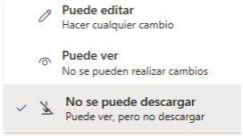

⬆️ _Haz click en "ikergl" para volver a la página de inicio._   

# Malditos adjuntos…

## …¡adjuntos malditos!

Te podrían cortar las manos por enviarme ese PowerPoint, Word o Excel como adjunto en un mail. ¡Hereje!

Si fuera algo informativo, te librarías. Pero si pretendes que colaboremos sobre ese contenido... mal empezamos. Porque ese adjunto está maldito. 

Esto es lo que pasará:
- Perderemos tiempo con idas y venidas adjuntando evoluciones del fichero en mails o chats.
- Tendremos dudas sobre cuál es la última versión. 
- Seremos más lentos porque esperará uno al otro para avanzar. O peor: cruzaremos ficheros y ninguno tendrá el último contenido. 
- Olvidaremos algún comentario en mitad de un hilo de correos infernal por no estar a mano en el fichero, en el lugar donde corresponde.
- Y sobre todo, ¡nos volveremos locos poniendo versiones y fechas en el nombre del fichero! 😭

 

_Dato friki: los peces pulmonados (en inglés lungfish) tienen la mayor longitud de genoma conocido, con un total de 130 mil millones de pares de base. Sabiéndolo, estás listo para la viñeta 😂:_

_Fuente:_ [_https://xkcd.com/3064/_](https://xkcd.com/3064/)

## La solución

¡Lo más probable es que la conozcas!
- En suite de Google: convierte tu .xlsx a .googlesheet
- En Microsoft 365:

Ya conoces la solución: pon el fichero en tu OneDrive o en un SharePoint (asociado o no a un Teams). En cualquiera de los dos, podemos compartir sólo un link y trabajar sobre ese fichero simultáneamente.
Y NO pongas número de versión ni fecha en el nombre del fichero.
En primer lugar, no hace falta porque sería redundante:
El versionado lo gestiona OneDrive/Sharepoint automáticamente.
Las fechas son metadatos de los ficheros: ya se sabe cuándo se creó y cuándo se editó por última vez.
En segundo lugar, si lo pones, tardará poco tiempo en ser un dato erróneo.
Keep it simple!

P.D. Si adjuntas el fichero en un chat (no canal) en Teams esperando que me lo descargue, es la misma herejía. Si por el contrario sabes que esa acción, por debajo, guarda el fichero en tu carpeta “Chats de Teams” de OneDrive y pretendes que colaboremos sobre esa copia… Estás salvado de la hoguera (eso sí, ese caso es poco probable, porque tus compartidos por OneDrive estarían todos en la misma carpeta… una zorrera 😂).

P.D.2 @Microsoft: por Tutatis, aquí falta una opción!!! Xxxxxxx "Puede editar, pero no descargar".
Sería una buena manera de fomentar la colaboración online, porque no permitiría a ningún hereje descargarlo para adjuntarlo…

 

 

___
Iker García Lafuente, xx yyy 2025
